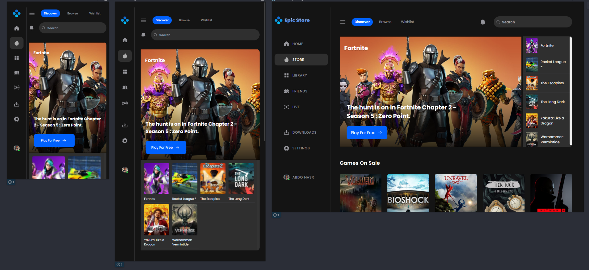

  
  
  
    

  

  <h2 align="center">Epic Games Store - Clone</h2>

  Responsive for all devices, 
  <a href="https://abdelrhman492.github.io/Epic-Clone">
    <strong>➥ Live Demo</strong>
  </a>

- Built using HTML, SCSS, and JavaScript.

### Demo Screeshots

